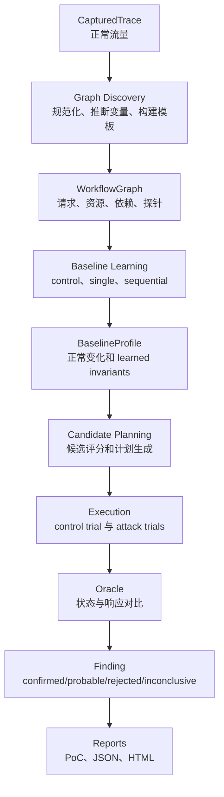

# StateBreaker 架构说明

这份文档给新手看整体流程。先不用理解每个函数，只要抓住一条主线：

```text
Recorded normal flow
  -> dependency graph
  -> baseline profile
  -> race candidates
  -> attack plans
  -> control/attack trials
  -> findings and reports
```

## 一次扫描怎么走



## 阶段说明

| 阶段 | 做什么 | 主要输入 | 主要输出 |
| --- | --- | --- | --- |
| Capture | 导入正常流程流量 | HAR/Postman/OpenAPI/manual trace | `CapturedTrace` |
| Graph Discovery | 推断变量流向，构建请求模板和 graph | `CapturedTrace`、project config | `WorkflowGraph`、`RequestTemplate`、`StateProbe` |
| Baseline Learning | 跑正常实验，学习状态变化和规则 | graph、templates、probes | `BaselineProfile`、baseline trials |
| Candidate Planning | 找可能 race 的动作并生成执行计划 | graph、baseline effects | `RaceCandidate`、`AttackPlan` |
| Execution | 执行 control 和 attack 实验 | attack plan、scheduler backend | `ExecutionTrial` |
| Oracle | 比较顺序执行和并发执行的差异 | control trial、attack trials、invariants | `Finding` |
| Reporting | 输出可复现证据 | finding、plan、trials | PoC、JSON、HTML |

## 核心模型

- `CapturedTrace`：一段正常流程，是全链路的原始材料。
- `RequestTemplate`：可重放请求，可能包含 `${variable}` 占位符。
- `WorkflowGraph`：请求、资源、变量绑定、依赖边和状态探针的图。
- `BaselineProfile`：正常行为画像，包括 effects 和 learned invariants。
- `RaceCandidate`：一个“可能发生 race”的假设。
- `AttackPlan`：把候选变成可执行的并发请求计划。
- `ExecutionTrial`：一次真实实验，包括 before/after state、responses 和 timeline。
- `Finding`：最终 verdict，必须引用真实 trial 证据。

## 推荐入口

用户视角先用一键检测，默认入口是：

```bash
statebreaker run --project my-target --proxy-capture
```

`run` 会把项目选择、正常流量录制、discovery 预览、扫描和报告生成串起来。需要逐步确认时使用 `statebreaker wizard`；需要精确控制阶段时，再使用底层命令：

- `statebreaker discover`：只跑 graph discovery，不执行并发攻击实验。适合先看工具是否理解了正常流。
- `statebreaker scan`：跑完整链路。只有这里会进入 baseline、planning、execution、oracle 和 reporting。

## 重要边界

- 核心包必须业务无关。业务名只允许在 `labs/` 和测试数据里出现。
- `CONFIRMED` 不能靠 HTTP 200 判断，必须有真实 trial 和状态证据。
- scheduler backend 只负责“如何同时释放请求”，不负责判定漏洞。
- oracle 只负责证据比较和 verdict，不负责生成请求。
- reporting 只做展示和导出，不改变证据。

## 新手阅读顺序

1. `src/statebreaker/models/`：先看数据结构。
2. `src/statebreaker/orchestration/stages.py`：看 discover 如何构建 graph。
3. `src/statebreaker/orchestration/scanner.py`：看 scan 如何串阶段。
4. `tests/orchestration/test_scanner.py`：看完整验收流程。
5. `tests/support/flows.py`：看每个 lab 的“正常流程”长什么样。
